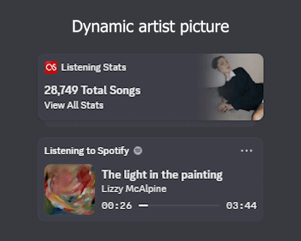
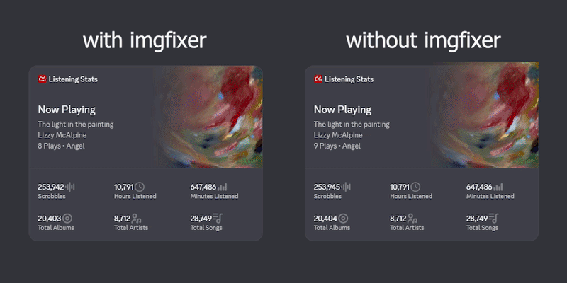
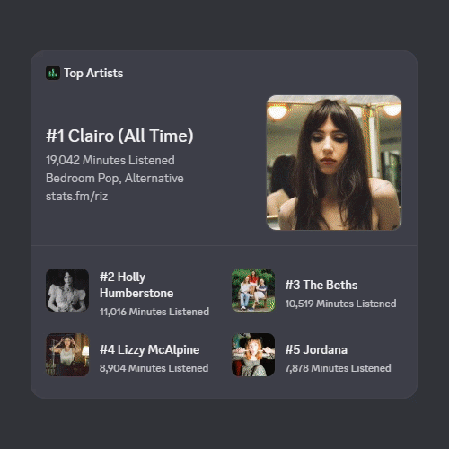

# WidgetFM

Real-time Discord profile widget that displays your Last.FM listening stats and top artists — with album art sourced from Lanyard, Spotify, and Last.FM.


---

## Showcase







---

## Features

- **Listening Stats widget** — Now Playing / Last Played track, scrobble count, play count subtitle, and six fully configurable stat slots (scrobbles, top artists/tracks/albums, hours/minutes listened, etc.)
- **Top Artists widget** — Your top 5 artists across three time ranges (All Time / 6 Months / 30 Days), rotating every 25 seconds
- **Three-source album art priority chain** — Lanyard (Discord Rich Presence, 640×640) → Spotify API → Last.FM (automatic fallback per track)
- **Dynamic artist images** — Scraped from Last.FM's photo gallery, with AudioDB as a fallback; served through [wsrv.nl](https://wsrv.nl) for consistent sizing
- **Smart image caching** — Locally built cache is bundled into the Docker image so the server never needs to scrape Last.FM directly
- **Configurable stat slots** — All six stat display slots are configurable from `config.py` without touching any other code
- **24/7 deployment** — Ships with a `Dockerfile` and a guide for [Fly.io](https://fly.io) free-tier hosting

---

## Prerequisites

- Python 3.11 or later (download from [python.org](https://www.python.org/downloads/))
- Git (download from [git-scm.com](https://git-scm.com/downloads))
- A [Last.FM](https://www.last.fm) account with API access
- Two Discord Applications (one per widget)
- *(Optional)* A [Spotify](https://developer.spotify.com/dashboard) app — for album art fallback when Last.FM has no artwork
- *(Optional)* A [stats.fm](https://stats.fm) account — required only for the Top Artists widget and `hoursstreamed` / `minutesstreamed` stat slots
- *(Optional)* A [Fly.io](https://fly.io) account for 24/7 hosting

---

## References

This project patches Discord's widget API. If you are setting up the widget config for the first time, these guides explain the full process:

- 📖 [How to Make Discord Widgets — Chloe Cinders](https://chloecinders.com/blog/discord-widgets)
- 🎥 [Video Tutorial — YouTube](https://youtu.be/gYv7D83u7yQ)

---

## Lanyard Setup

This script uses [Lanyard](https://github.com/phineas/lanyard) as the primary album art source (reads your Spotify rich presence from Discord).

**You must join the Lanyard Discord server** to enable monitoring for your account:
👉 [discord.gg/UrXF2cfJ7F](https://discord.com/invite/UrXF2cfJ7F)

> Alternatively, you can self-host your own Lanyard instance — see [github.com/phineas/lanyard](https://github.com/phineas/lanyard) for instructions.

If your account is not monitored by Lanyard, the script automatically falls back to Spotify → Last.FM for album art. Everything else still works normally.

---

## Get Started

Open a terminal (PowerShell on Windows, Terminal on macOS/Linux) and run:

```bash
# 1. Clone the repository
git clone https://github.com/RizukiRetz/widgetfm.git

# 2. Enter the project folder
cd widgetfm

# 3. Install dependencies
pip install -r requirements.txt

# 4. Create your config file
cp .env.example .env    # Windows: copy .env.example .env
```

After filling in `.env`, run the script:

```bash
python upstats.py
```

On Windows you can also double-click `run.bat`.

---

## Discord Application Setup

You need **two separate Discord Applications** — one for each widget.

### Step 1 — Enable the Widget Editor

The widget editor in the Discord Developer Portal is behind an experiment flag. You need to unlock it manually once.

1. Go to the [Discord Developer Portal](https://discord.com/developers/home) in your **browser**.
2. Press `Ctrl + Shift + I` (or `Cmd + Option + I` on macOS) to open Developer Tools.
3. Go to the **Console** tab, paste the code below, and press Enter:

```js
let _mods = webpackChunkdiscord_developers.push([[Symbol()],{},r=>r.c]);
webpackChunkdiscord_developers.pop();
let findByProps = (...props) => {
  for (let m of Object.values(_mods)) {
    try {
      if (!m.exports || m.exports === window) continue;
      if (props.every((x) => m.exports?.[x])) return m.exports;
      for (let ex in m.exports) {
        if (props.every((x) => m.exports?.[ex]?.[x]) && m.exports[ex][Symbol.toStringTag] !== 'IntlMessagesProxy') return m.exports[ex];
      }
    } catch {}
  }
}
findByProps("getAll").getAll().find(e=>e.getName() === "ApexExperimentStore").createOverride("2026-03-widget-config-editor", 1)
```

> ⚠️ Re-run this code every time you refresh or return to the Developer Portal page.

### Step 2 — Create the Applications

1. In the Developer Portal, go to **Applications** → **New Application**.
2. Name it (e.g. `Listening Stats`) → **Create**.
3. Go to **Bot** → **Add Bot** → confirm.
4. Copy the **Application ID** (from *General Information*) and **Bot Token** (from *Bot*).
5. Repeat for the second application (e.g. `Top Artists`).

### Step 3 — Configure the Widget Fields

In each Discord Application, go to **Games → Widget → Create Widget**.

Then go to the **Content** tab and add each field. Set **Value Type** to **User Data** and the **Data Field** to the exact name listed in the tables below.

> ⚠️ **Field names are case-sensitive and must match exactly.**

---

#### Listening Stats widget (Application #1)

**Widget Top** — Image + Title + Subtitle 1 + Subtitle 2 + Subtitle 3

| Field name | Type | Maps to |
|---|---|---|
| `bannerwidgettop` | **Image** | Album artwork (updates every track). Set a fallback image. |
| `nowplaying` | Text / Title | `"Now Playing"` or `"Last Played"` |
| `nptrack` | Text / Subtitle 1 | Track name |
| `npartist` | Text / Subtitle 2 | Artist name |
| `npcount` | Text / Subtitle 3 | Play count + album (e.g. `3 Plays • Music, Fashion, Film`) |

**Widget Bottom** — Stats Grid layout (6 stats, each with Value + Label)

| Field name | Type | Notes |
|---|---|---|
| `lsstat1` | Text / Stat Value | Stat slot 1 value — configurable in `config.py` |
| `lsstat2` | Text / Stat Value | Stat slot 2 value |
| `lsstat3` | Text / Stat Value | Stat slot 3 value |
| `lsstat4` | Text / Stat Value | Stat slot 4 value |
| `lsstat5` | Text / Stat Value | Stat slot 5 value |
| `lsstat6` | Text / Stat Value | Stat slot 6 value |
| `lslabel1` | Text / Stat Label | Stat slot 1 label (auto-generated by script) |
| `lslabel2` | Text / Stat Label | Stat slot 2 label |
| `lslabel3` | Text / Stat Label | Stat slot 3 label |
| `lslabel4` | Text / Stat Label | Stat slot 4 label |
| `lslabel5` | Text / Stat Label | Stat slot 5 label |
| `lslabel6` | Text / Stat Label | Stat slot 6 label |

**Mini Profile** — combined value + label

| Field name | Type | Notes |
|---|---|---|
| `lsmini` | Text | Single combined string (e.g. `28,745 Total Songs`). Label toggle: **off** in Discord editor. |
| `bannermini` | **Image** | Artist photo (updates per artist or track). Set a fallback image. |

> ⚠️ **Set a default fallback image** for `bannerwidgettop` and `bannermini`. This shows before the first update or when no artwork is available.

---

#### Top Artists widget (Application #2)

**Widget Top** — Image + Title + Subtitle 1 + Subtitle 2 + Subtitle 3

| Field name | Type | Example value |
|---|---|---|
| `1artistimg` | **Image** | #1 artist photo |
| `1artisttitle` | Text / Title | `#1 Holly Humberstone (All Time)` |
| `1minutesplayed` | Text / Subtitle 1 | `1,234 Minutes Listened` |
| `1genre` | Text / Subtitle 2 | `Indie Pop, Singer-Songwriter` |
| `tasubtitle3` | Text / Subtitle 3 | `stats.fm/YourUsername` (auto-generated, see below) |

**Widget Bottom** — Collection layout (artists #2–#5)

| Field name | Type | Example value |
|---|---|---|
| `2artistimg` | **Image** | #2 artist photo |
| `2artisttitle` | Text | `#2 Olivia Rodrigo` |
| `2minutesplayed` | Text | `987 Minutes Listened` |
| `3artistimg` | **Image** | #3 artist photo |
| `3artisttitle` | Text | `#3 Gracie Abrams` |
| `3minutesplayed` | Text | `654 Minutes Listened` |
| `4artistimg` | **Image** | #4 artist photo |
| `4artisttitle` | Text | `#4 Clairo` |
| `4minutesplayed` | Text | `321 Minutes Listened` |
| `5artistimg` | **Image** | #5 artist photo |
| `5artisttitle` | Text | `#5 Phoebe Bridgers` |
| `5minutesplayed` | Text | `100 Minutes Listened` |

> ⚠️ **Set a default fallback image** for all five `{n}artistimg` fields.

> ℹ️ **`tasubtitle3` (Subtitle 3 of Widget Top)** — By default, the script auto-generates `stats.fm/{STATSFM_USERNAME}` from your `.env`. To display a different link or text, set `TA_SUBTITLE3 = "your text here"` in `config.py`.
> In the Discord widget editor, set this field's **Value Type** to **User Data**, **Data Field**: `tasubtitle3`.

### Step 4 — Apply the Application Identity

Follow the [Chloe Cinders guide](https://chloecinders.com/blog/discord-widgets) under **"Applying an Application Identity"** using the [Widget Identity Creator](https://github.com/chloecinders/widget-identity-creator/releases) tool. This step links the widget config to your Discord profile.

### Step 5 — Add the Widget to Your Profile

Follow the guide under **"Adding the Widget to your Profile"** to pin both widgets to your Discord profile using the browser console snippet.

---

## Configuration

Copy `.env.example` to `.env` and fill in your credentials:

| Variable | Required | Where to find it |
|---|---|---|
| `LAST_FM_USERNAME` | ✅ | Your Last.FM username |
| `API_KEY` | ✅ | [last.fm/api/account/create](https://www.last.fm/api/account/create) |
| `USER_ID` | ✅ | Discord → Settings → Advanced → Developer Mode → right-click your profile |
| `APPLICATION_ID` | ✅ | Discord Developer Portal → Application #1 → General Information |
| `BOT_TOKEN` | ✅ | Discord Developer Portal → Application #1 → Bot → Reset Token |
| `TOPARTISTS_APPLICATION_ID` | ✅ | Discord Developer Portal → Application #2 → General Information |
| `TOPARTISTS_BOT_TOKEN` | ✅ | Discord Developer Portal → Application #2 → Bot → Reset Token |
| `STATSFM_USERNAME` | ⚪ Optional | Required for Top Artists widget and `hoursstreamed`/`minutesstreamed` stat slots |
| `DISCORD_IMAGE_WEBHOOK_URL` | ⚪ Optional | Required when `IMGFIXER_ENABLED = True` in `config.py` |
| `SPOTIFY_CLIENT_ID` | ⚪ Optional | [developer.spotify.com/dashboard](https://developer.spotify.com/dashboard) — album art fallback |
| `SPOTIFY_CLIENT_SECRET` | ⚪ Optional | Same app as above |
| `SPOTIFY_REFRESH_TOKEN` | ⚪ Optional | Run `python spotify_auth.py` once after setting the two above |

Additional settings (intervals, stat slot types, rotation, `TA_SUBTITLE3`, image pool size, blacklisted image hashes) can be tuned in [`config.py`](config.py).

---

## Spotify Setup (Optional)

Spotify is used as a fallback album art source when Last.FM has no artwork for a track.

1. Create a Spotify app at [developer.spotify.com/dashboard](https://developer.spotify.com/dashboard)
2. Add `http://127.0.0.1:8888/callback` as a Redirect URI in the app settings
3. Copy `SPOTIFY_CLIENT_ID` and `SPOTIFY_CLIENT_SECRET` to `.env`
4. Run `python spotify_auth.py` once — it opens a browser and saves your refresh token automatically

---

## Fly.io Deployment (24/7 free hosting)

See [`deploy_flyioEN.md`](deploy_flyioEN.md) for the full step-by-step guide.

---

## Image cache

`image_cache.json` stores image URLs scraped from Last.FM, keyed by artist name, with a 30-day TTL. It is committed to Git and bundled into Docker images on deploy. To refresh stale images, run the script locally for a while and then re-deploy.

### Blacklisting wrong images

If a wrong photo appears in a widget, copy the 32-char hash from the `wsrv.nl` URL shown in the script's log output and add it to `BLACKLISTED_HASHES` in [`config.py`](config.py):

```python
BLACKLISTED_HASHES: set[str] = {
    "309a64bc97a0c73ac25968e6b4f0aa69",  # wrong photo uploaded to Artist X's Last.FM page
}
```

The blacklist is applied both during scraping and retroactively when loading from cache.

---

## License

This project is licensed under the [GNU General Public License v3.0](LICENSE).
